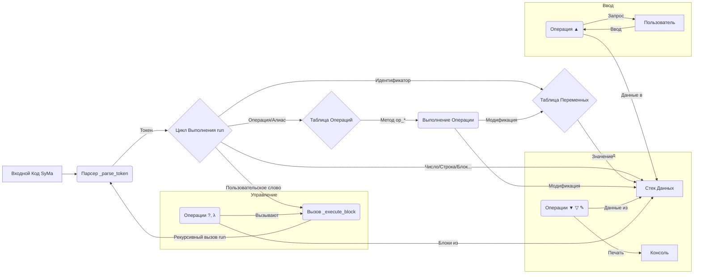

# SyMa-lang
programming language written using a neural network (GEMINI 2.5)


# SyMa Language Reference (v0.8)



## 1. Введение

**SyMa** (Symbolic Math / Stack Math) — это простой интерпретируемый язык программирования, основанный на стеке и использующий Обратную Польскую Запись (RPN). Язык разработан с акцентом на математические вычисления, работу с массивами (с использованием NumPy) и предлагает лаконичный синтаксис с уникальными Unicode-символами для операций, а также текстовые алиасы и возможность создания пользовательских слов (функций) для лучшей читаемости и структурирования кода.

**Ключевые особенности:**

*   **Стековая архитектура:** Все данные и результаты операций хранятся и передаются через стек.
*   **RPN (Обратная Польская Запись):** Операторы следуют за операндами (`5 3 +` вместо `5 + 3`).
*   **Гибкий синтаксис:** Поддержка уникальных Unicode-символов и интуитивно понятных текстовых алиасов для операций и констант.
*   **Интеграция с NumPy:** Мощные возможности для работы с N-мерными массивами и научными вычислениями.
*   **Динамическая типизация:** Тип данных определяется значением, хранящимся в переменной или на стеке.
*   **Пользовательские слова (Функции):** Возможность определения и вызова собственных последовательностей команд.
*   **Интерактивный REPL:** Удобная среда для экспериментов и быстрых вычислений с историей команд и автозаменой.

## 2. Как Работает Язык

Интерпретатор SyMa последовательно читает и обрабатывает входной код (из файла или REPL), выполняя следующие шаги в цикле (`run`):

1.  **Пропуск:** Пробелы, символы новой строки и комментарии (`//...`) игнорируются.
2.  **Парсинг Токена (`_parse_token`):** Интерпретатор читает следующий значащий фрагмент кода (токен) с текущей позиции. Он пытается распознать:
    *   **Числа:** (`123`, `-5.0`, `1e-3`, `inf`) -> `NUMBER`
    *   **Строки:** (`"текст"`) -> `STRING`
    *   **Блоки Кода:** (`{...}`) -> `BLOCK`
    *   **Массивы:** (`[...]`) -> `ARRAY` (преобразуется в NumPy array)
    *   **Слова/Идентификаторы:** (`add`, `pi`, `myVar`, `square`)
        *   Если слово - известный алиас операции (`add`, `sin`, `store`) -> `OPERATOR`
        *   Если слово - известная переменная/константа (`pi`, `myVar`)
            *   Если значение - блок кода -> `USER_WORD`
            *   Иначе -> `VARIABLE_WORD`
        *   Если за словом следует `→` или `=` (и стек не пуст) -> `IDENTIFIER_ASSIGN` (или `ASSIGN_VIA_EQ`)
        *   Иначе (неизвестное слово) -> `NameError`
    *   **Односимвольные Операторы/Переменные:** (`+`, `√`, `π`, `→`, `=`)
        *   Если символ - операция (`+`, `√`, `=`) -> `OPERATOR`
        *   Если символ - константа (`π`, `𝑒`) -> `VARIABLE_SYM`
    *   Если символ не распознан -> `SyntaxError`
3.  **Обработка Токена (`run`):**
    *   **Значения** (`NUMBER`, `STRING`, `BLOCK`, `ARRAY`, `VARIABLE_SYM`, `VARIABLE_WORD`): Помещаются на стек (`push`).
    *   **Имена для присваивания** (`IDENTIFIER_ASSIGN`, `ASSIGN_VIA_EQ`): Помещаются на стек (ожидая вызова `store`/`→`/`=`).
    *   **Операторы** (`OPERATOR`): Вызывается соответствующий метод `op_*` (например, `op_add`, `op_store`). Операция берет аргументы со стека (`pop`) и помещает результат (`push`).
    *   **Пользовательские Слова** (`USER_WORD`): Вызывается метод `_execute_block`, который рекурсивно запускает `run` для кода внутри блока, используя тот же стек и переменные.
4.  **Продвижение:** Указатель чтения потока устанавливается на позицию сразу после обработанного токена.
5.  **Повторение:** Цикл продолжается до конца кода или возникновения ошибки.

## 3. Типы Данных и Синтаксис

*   **Числа:** Целые (`int`), Вещественные (`float`), Комплексные (`complex`), Бесконечность (`inf`). Записываются стандартно: `123`, `-5`, `3.14`, `1.5e-3`.
*   **Логические:** `True` (`⊤`) и `False` (`⊥`). Также можно использовать слова `True` и `False`.
*   **Строки:** В двойных кавычках (`"`). Пример: `"Привет"`, `"Result: "`.
*   **Массивы NumPy:** В квадратных скобках `[]`. Элементы разделяются запятыми (`,`), строки (для 2D) — точкой с запятой (`;`). Пример: `[1, 2, 3]`, `[[1, 0]; [0, 1]]`. Создаются с помощью `eval` (будьте осторожны при вводе из ненадежных источников).
*   **Блоки Кода:** В фигурных скобках `{}`. Содержат валидный код SyMa. Пример: `{ dup × }`. Представляют собой строки до момента выполнения.
*   **Переменные:**
    *   **Встроенные константы:** `π`, `𝑒`, `𝑖`, `∞`, `⊤`, `⊥` и их текстовые алиасы `pi`, `tau`, `e`, `j`, `inf`, `True`, `False`.
    *   **Пользовательские:** Имена начинаются с буквы или `_`, содержат буквы, цифры, `_`. Создаются через `store`, `→`, `assign` или `=`.
*   **Операции/Слова:** Одиночные Unicode-символы или текстовые алиасы/пользовательские слова.
*   **Комментарии:** Начинаются с `//` до конца строки.

## 4. Справочник Операций

(См. подробное описание в предыдущей документации или в коде методов `op_*`)

### 4.1. Стековые
`┐`(drop), `┤`(dup), `⇌`(swap), `┴`(over), `↻`(rot), `↺`(nrot), `☰`(depth), `¡`(clear)

### 4.2. Арифметические
`+`(add), `-`(sub), `×`(mul), `÷`(div), `^`(pow), `√`(sqrt), `∣`(abs/det/norm), `%`(mod), `‼`(fact)

### 4.3. Сравнения
`<`(lt), `>`(gt), `=`(eq), `≠`(neq), `≤`(le), `≥`(ge)

### 4.4. Логические
`¬`(not), `∧`(and), `∨`(or), `⊕`(xor)

### 4.5. Математические Функции
`∿`(sin), `κ`(cos), `τ`(tan), `㏑`(ln), `㏒`(log10), `ε`(exp), `⌈`(ceil), `⌊`(floor), `◎`(round)

### 4.6. Переменные и Выполнение
`→`(store/assign), `=` (только для RPN `value "name" =`), `!`(exec/execute)

### 4.7. Ввод / Вывод
`▼`(println), `▽`(print), `✎`(prints), `▲`(input)

### 4.8. Массивы и Линейная Алгебра
`@`(matmul), `⋅`(dot), `⍉`(transpose), `\`(solve), `𝟙`(identity/eye), `📐`(shape), `↕`(range)

### 4.9. Управление Потоком
`?`(if), `λ`(while)

### 4.10. Строки
`+`(add - перегружен), `⌢`(concat)

## 5. Переменные и Пользовательские Слова

### 5.1. Создание Переменных

```syma
// Способ 1: Оператор 'store' или 'assign' или '→'
10 "myVar" store
"hello" "msg" assign
[1 2] "vec" →

// Способ 2: Оператор '=' после имени (в RPN-стиле)
3.14 "piApprox" =
```

### 5.2. Создание Пользовательских Слов (Функций)

Присвоение блока кода переменной.

```syma
// Возвести в квадрат
{ dup mul } "square" store

// Увеличить на 1
{ 1 + } "inc" store

// Вычислить (x+1)^2
{ inc square } "incSquare" store
```

### 5.3. Использование Переменных и Слов

Просто укажите имя переменной или слова. Интерпретатор поместит значение на стек или выполнит код блока.

```syma
myVar println      // Напечатает 10
vec println        // Напечатает [1 2]
5 square println   // Напечатает 25
5 incSquare println // Напечатает 36
```

## 6. Примеры Кода

### 6.1. Простые вычисления

```syma
// (10 + 5 * 2) / 4
10 5 2 mul + 4 div println // Используем алиасы
// Вывод: 5.0
```

### 6.2. Работа с массивами

```syma
[1 2 3] "v1" store
[4 5 6] "v2" store

// Скалярное произведение
v1 v2 dot println
// Вывод: 32

// Поэлементное сложение
v1 v2 add println
// Вывод: [5 7 9]

// Умножение вектора на скаляр
v1 3 mul println
// Вывод: [3 6 9]
```

### 6.3. Условная логика и функции

```syma
// Функция: вернуть абсолютное значение, если < 0, иначе само число
{ dup 0 < { abs } if } "positiveOnly" store
// 'if' здесь используется без 'else', если число >= 0, блок { abs } не выполняется

5 positiveOnly println  // Вывод: 5
-5 positiveOnly println // Вывод: 5
```

### 6.4. Цикл `while`

```syma
// Напечатать числа от 5 до 1
5 "counter" store
{ counter 0 > } // Условие: counter > 0
{
    counter println // Печатаем counter
    counter 1 sub "counter" store // counter = counter - 1
} while
// Вывод:
// 5
// 4
// 3
// 2
// 1
```

## 7. REPL (Интерактивный Режим)

Запустите `python syma_interpreter.py` без аргументов.

*   **Команды:** `quit`, `stack`, `vars`, `ops`, `help`.
*   Ввод кода SyMa исполняется построчно.
*   Автозамена ` >= ` -> `≥`, ` <= ` -> `≤`, ` != ` -> `≠`, ` * ` -> `×`, ` / ` -> `÷` (между пробелами).
*   Верхний элемент стека печатается как `-> значение` после выполнения (если не было ошибки или операции печати).

## 8. Запуск Файлов

```bash
python syma_interpreter.py <имя_файла.syma>
```
